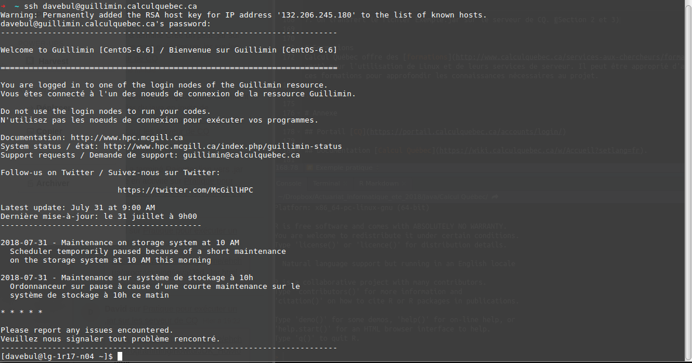
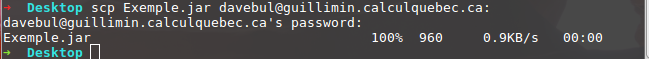
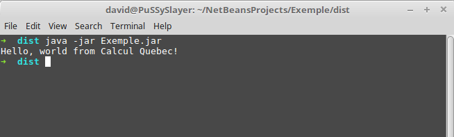
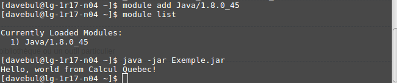

\newpage

# Comment faire un compte CQ avec parrainage
Pour faire un compte Calcul Québec, il faut se créer un compte sur le portail d'inscription de [Calcul Canada](https://ccdb.computecanada.ca/security/login). Lors de l'inscription, certaines informations importantes doivent être sélectionnées pour bien configurer le compte. D'abord, pour l'institution, il faut choisir Calcul Québec : Université Laval. Pour le département, il faut inscrire la Faculté des sciences et de génie. Ensuite, pour le statut il faut choisir entre étudiant de 1er cycle ou à la maîtrise selon le cas. 

Par la suite, une case de parrainage va se rajouter. Il faut rajouter l'identifiant de Louis qui correspond à rea-093-01.

La dernière étape pour valider le compte de Calcul Canada est de valider le compte via une validation courriel. De plus,Louis doit aussi faire la même validation, mais pour votre parrainage. Ensuite, il va être possible de se connecter au compte Calcul Canada.

Pour avoir accès aux ordinateurs, il faut ensuite demander un service à un partenaire régional, en l'occurrence Calcul Québec. Dans l'onglet *Mon compte*, on retrouve l'option *Demander un compte à un consortium*. Il suffit ensuite de faire la demande à Calcul Québec. La page sera redirigée vers une page d'inscription à Calcul Québec.

Lors de l'inscription, il faut choisir les ressources associées au compte soit Guillimin. 


# Comment accéder au dépôt des fichiers
## Prérequis
Étant donné que les serveurs de calcul n'ont pas d'interface graphique, les instructions et commandes doivent être effectuées via une invite de commande. Calcul Québec offre donc un [Wiki](https://wiki.calculquebec.ca/w/Introduction_%C3%A0_Linux) sur les invites de commande.  De plus, voici un document de référence qui contient un chapitre de matière sur les [invites de commande](https://vigou3.gitlab.io/programmer-avec-r/). 

## Informations sur la connexion
La connexion au serveur de calcul s'effectue via un protocole [SSH](https://fr.wikipedia.org/wiki/Secure_Shell). Les informations importantes à savoir pour s'y connecter sont:

1. Le nom du serveur : guillimin.calculquebec.ca
2. Le port de connexion TCP : 22

Il est beaucoup plus facile d'établir une connexion SSH sous Mac OS X et Linux, car ce protocole est natif avec les systèmes UNIX. Pour l'utilisation sous Window il faut utiliser une connexion à distance via WinSCP.

## Linux & Mac OS X
### Connexion à la console à distance

En utilisant le gabarit de commande suivant et le mot de passe utiliser pour se connecter à un compte CQ, on est en mesure d'accéder à la commande à distance du serveur.

```{bash, eval=FALSE}
ssh nom@<serveur>.ca
# nom correspond à votre nom d'utilisateur CQ
# <serveur>.ca correspond à l'adresse du serveur
```

#### Exemple
En utilisant mon nom d'utilisateur et le serveur Guillimin, on aurait la commande suivante :

```{bash, eval=FALSE}
ssh davebul@guillimin.calculquebec.ca
```



## Windows
### Connexion à la console à distance

PuTTY est le client SSH recommander par CQ, il s'agit d'un client sans installation. Il faut l'ouvrir et y inscrire l'adresse du serveur et du port. On inscrit l'adresse du serveur dans *Host Name (or IP Address)*. Lors de la première connexion, il faut accepter la clef RSA du serveur. 

Cela va ouvrir une invite de commande ou il faut entrer le nom d'utilisateur et votre mot de passe utiliser pour vous connecter au portail Calcul Québec.

Par exemple, dans mon cas il s'agit de davebul pour mon nom d'utilisateur.

# Comment ajouter ou modifier des fichiers
Avec une invite de commande locale, il est possible de transférer des fichiers entre votre ordinateur et le serveur. 

## Linux & Mac OS X

### De votre ordinateur vers le serveur (un fichier)
```{bash, eval=FALSE}
scp monfichier nom@serveur.ca:
```

### Du serveur vers votre ordinateur (un fichier)

```{bash, eval=FALSE}
scp nom@serveur.ca:monfichier .
```


### De votre ordinateur vers le serveur (un répertoire de fichier)

```{bash, eval=FALSE}
scp -rp monrep nom@serveur.ca:
```

### Du serveur vers votre ordinateur (un répertoire de fichier)

```{bash, eval=FALSE}
scp -rp nom@serveur.ca:monrep/ .
```

#### Exemple

```{bash, eval=FALSE}
# Mon ordinateur vers le serveur
scp monfichierlocal davebul@guillimin.calculquebec.ca:

# Serveur vers mon ordinateur
scp davebul@guillimin.calculquebec.ca:monfichierlocal .

# Mon ordinateur vers le serveur - répertoire
scp -rp monreplocal davebul@guillimin.calculquebec.ca:

# Serveur vers mon ordinateur - répertoire
scp -rp davebul@guillimin.calculquebec.ca:monrep/ .
```


## Windows
Pour transférer des fichiers sous Windows, il faut le client graphique SFTP [WinSCP](https://winscp.net/eng/docs/lang:fr). On établit la connexion en spécifiant le nom d'hôte soit :guillimin.calculquebec.ca. De plus, on définit déjà son nom d'utilisateur et le mot de passe. Il faut aussi accepter la clef RSA lors de la première connexion. Il sera ensuite possible de faire des glisser-déposer pour les fichiers à transférer.

# Comment exécuter un JAR avec l'invite de commande

## Les modules
Tout d'abord, il est important de lire la [documentation](https://wiki.calculquebec.ca/w/Votre_code_sur_les_serveurs_de_calcul) sur les modules, car ceux-si sont nécessaire pour faire exécuter le .jar. Il faut aussi configurer le chargement automatique des modules pour éviter les erreurs ou la répétition inutile des mêmes commandes.

### Listes des modules nécessaires

Voici une liste des modules nécessaires au moment d'écrire ce document :

1. Java/1.8.0_45 - ou la plus récente version
2. 

## Exécution d'une tâche

### Compilation 
Étant donné la dépendance avec des librairies, il va être nécessaire d'avoir une archive Java (JAR). L'IDE Netbeans permet de compiler et compresser le logiciel en fichier JAR très facilement. Pour effectuer la compilation, cette [explication](https://stackoverflow.com/questions/9681876/how-to-create-a-jar-file-in-netbeans) sur *StackOverflow* est très complète.

### Exécution de la tâche
Le [Wiki](https://wiki.calculquebec.ca/w/Ex%C3%A9cuter_une_t%C3%A2che#tab=tab4) de CQ pour l’exécution d'une tâche est la ressource la plus fiable et précise pour expliquer cette section. Cette section comporte plutôt des notes et spécifications supplémentaires ainsi qu'un exemple pratique. 

### Notes & spécifications
#### Notes
Déterminer l'allocation des ressources reste une tâche difficile à faire. Demander l'aide de CQ au besoin.

#### Spécifications
Il est important de lire la section de documentation additionnelle spécifique au serveur Guillimin pour éviter tout problème de soumission au serveur.

### Exemple pratique
1. Ouvrir NetBeans et créer un nouveau projet qu'on va appeler Exemple
2. Ajouter un fichier Hello.java et supprimer le fichier Exemple.java
3. Écrire et sauvegarder le code suivant dans le fichier Hello.java:
```{java, eval = FALSE}
public class Hello {   // To save as "Hello.java" under "~/myProject"
   public static void main(String[] args) {
      System.out.println("Hello, world from Calcul Quebec!");
   }
}
```
4. Compiler le projet. Ne pas oublier d'avoir configuré les options de packaging de votre projet (voir section compilation)
5. Ouvrir une invite de commande dans le répertoire */NetBeansProjects/Exemple/dist*
6. Pour exécuter un fichier JAR on utilise la commande java avec l'option -jar. 
```{bash, eval = FALSE}
java -jar Exemple.jar
```


7. On transfère le fichier Exemple.jar sur le serveur de CQ. (Section 2 et 3)
8. On importe le module Java et on utilise la commande d'exécution du fichier JAR.
```{bash, eval = FALSE}
module add Java/1.8.0_45
java -jar Exemple.jar
```

Ici, on n'utilise pas réellement les ressources du supercalculateur étant donné que le travail à exécuter est minime. C'est surtout pour donner une intuition sur le processus. 



# Formations
Calcul Québec offre des [formations](http://www.calculquebec.ca/services-aux-chercheurs/formations/#ouvert) pour l'utilisation de Linux et de leurs services de serveur. Il peut être approprié d'assister à ces formations pour approfondir les connaissances nécessaires au projet. De plus, le Wiki de CQ comporte un [exemple de script](https://wiki.calculquebec.ca/w/Exemple_de_script_avec_documentation_des_options_de_qsub) annoté.

## Formation vidéo
Calcul Québec possède une [chaine YouTube](https://www.youtube.com/channel/UCtWVrQmCfknjjQTHYQvnDxw) qui contient de nombreux vidéos sur les notions importantes pour utiliser leurs serveurs. On note en autre un vidéo sur [l'utilisation des nouveaux serveurs](https://www.youtube.com/watch?v=CK8DCL2WixE) et [Introduction au Calcul informatique de pointe](https://www.youtube.com/watch?v=tR0XTE1JyZ8).

\newpage

# Annexe

## Portail [CQ](https://portail.calculquebec.ca/accounts/login/)

## Documentation [Calcul Québec](https://wiki.calculquebec.ca/w/Accueil?setlang=fr).

## Rappel sur l'[invite de commande](https://vigou3.gitlab.io/programmer-avec-r/)

## [Wiki console](https://wiki.calculquebec.ca/w/Introduction_%C3%A0_Linux)

## Framework [Oh My Zsh](https://github.com/robbyrussell/oh-my-zsh) pour améliorer votre invite de commande locale

## [Wiki connexion & transfert](https://wiki.calculquebec.ca/w/Se_connecter_et_transf%C3%A9rer_des_fichiers#tab=tab2)

## [Wiki exécuter un fichier](https://wiki.calculquebec.ca/w/Ex%C3%A9cuter_une_t%C3%A2che#tab=tab4) 

## Liste des [formations](http://www.calculquebec.ca/services-aux-chercheurs/formations/#ouvert) à Calcul Québec

## [How to install JDK](https://www3.ntu.edu.sg/home/ehchua/programming/howto/JDK_Howto.html)

## [Tutoriel JAR](https://www3.ntu.edu.sg/home/ehchua/programming/java/J9d_Jar.html) en invite de commande

## Compiler un JAR avec [NetBeans 7.4](https://stackoverflow.com/questions/9681876/how-to-create-a-jar-file-in-netbeans)

## [Chaine YouTube Calcul Québec](https://www.youtube.com/channel/UCtWVrQmCfknjjQTHYQvnDxw)

## [Vidéo d'utilisation des nouveaux serveurs](https://www.youtube.com/watch?v=CK8DCL2WixE)

## [Vidéo d'introduction au Calcul informatique de pointe](https://www.youtube.com/watch?v=tR0XTE1JyZ8)